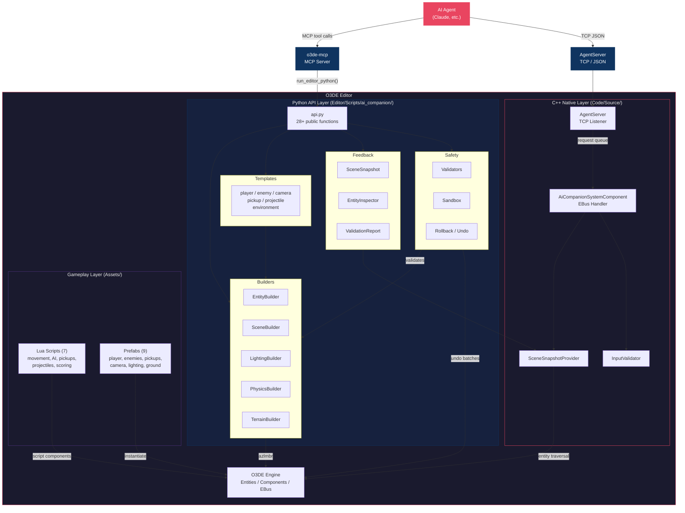

# Architecture

This document describes the high-level architecture of the AI Companion Gem for
Open 3D Engine (O3DE).

## Overview

AI Companion is an O3DE Gem that provides a bridge between AI agents and the O3DE
Editor. It exposes a high-level Python API that AI agents invoke (typically via
[o3de-mcp](https://github.com/nickschuetz/o3de-mcp)) to create entities, set up
scenes, and inspect the running editor state. A C++ layer provides fast scene
introspection via EBus and a TCP-based AgentServer for direct agent communication.

## Architecture Diagram



## Component Descriptions

### Python API Layer

The Python API (`Editor/Scripts/ai_companion/`) is the primary interface for AI
agents. All functions return JSON strings for reliable parsing.

| Component | Purpose |
|-----------|---------|
| **api.py** | Main entry point exposing 28+ public functions for scene setup, entity creation, inspection, and undo |
| **Builders** | Fluent builder classes for constructing entities, scenes, lighting rigs, physics bodies, and terrain |
| **Templates** | Pre-configured factory functions for common entity types (player, enemy, camera, pickup, projectile, environment) |
| **Feedback** | Scene introspection: snapshots, entity inspection, and validation reports |
| **Safety** | Input validation, operation sandboxing, and automatic undo/rollback |

### C++ Native Layer

The C++ layer (`Code/Source/`) provides performance-critical operations and the
network server.

| Component | Purpose |
|-----------|---------|
| **AiCompanionSystemComponent** | EBus handler connecting Python API to C++ scene operations |
| **SceneSnapshotProvider** | Fast entity traversal and JSON serialization of scene state |
| **InputValidator** | C++ counterpart to Python validators for entity names and component types |
| **AgentServer** | TCP listener (default `127.0.0.1:4600`) with length-prefixed JSON protocol, TLS support, and audit logging |

### Gameplay Layer

| Component | Purpose |
|-----------|---------|
| **Lua Scripts** | 7 scripts covering twin-stick movement, enemy chase AI, damage, health pickups, projectile launching, scoring, and game-over detection |
| **Prefabs** | 9 ready-to-use prefabs for rapid prototyping (player, enemies, pickups, projectile, camera, lighting, ground) |

## Data Flow

1. **AI Agent** sends a request (via MCP tool call or TCP JSON message)
2. **Python API** receives the call and delegates to the appropriate builder or template
3. **Safety layer** validates all inputs (names, positions, asset paths) and begins an undo batch
4. **Builders** invoke `azlmbr` (O3DE Python bindings) to create entities and attach components
5. On success the undo batch is committed; on failure it is rolled back automatically
6. A **JSON response** with entity IDs, component IDs, and status is returned to the agent
7. The agent can call **Feedback** functions to inspect the scene and decide its next action

## Network Protocol (AgentServer)

The AgentServer uses a length-prefixed JSON protocol over TCP:

```
[4-byte message length (big-endian)] [JSON body]
```

Supported request types: `ping`, `get_api_version`, `get_scene_snapshot`,
`get_entity_tree`, `validate_scene`, `execute_python`.

Requests that require main-thread access (`get_scene_snapshot`, `get_entity_tree`,
`validate_scene`, `execute_python`) are dispatched via a lock-free queue from the
client thread to the `AZ::SystemTickBus` handler, which processes them every few
milliseconds regardless of editor focus state. A 30-second timeout prevents
deadlocks if the main thread is blocked.

Security features:
- Optional TLS/SSL encryption (TLS 1.2+, strong cipher suites: `HIGH:!aNULL:!MD5:!RC4`)
- Configurable audit logging (Minimal, Standard, Verbose)
- Maximum message size: 16 MiB
- `execute_python` disabled in secure mode
- Request ID sanitization (alphanumeric only, prevents path traversal)
- Injection-proof Python script encoding (hex-escaped byte literals)
- Exclusive temp file creation (`O_EXCL`) with restrictive permissions (`0600`)

Reliability features:
- Socket inheritance prevention (`SOCK_CLOEXEC` / `FD_CLOEXEC` / `SetHandleInformation`)
  ensures only the Editor process owns the listen socket
- Stale connection detection via non-blocking socket probing in the accept loop
- Platform-specific `accept` hardening: `accept4` on Linux, `fcntl` on macOS,
  `SetHandleInformation` on Windows

### Known Limitations

- **No authentication**: The server does not require API keys or tokens. Bind to
  localhost (the default) and rely on OS-level access control.
- **No Python sandbox**: `execute_python` runs arbitrary code with full editor
  privileges. Use secure mode to disable it in untrusted environments.
- **Single client**: Only one TCP connection is accepted at a time.

## Safety Architecture

```
Input arrives
  --> Validators (name format, position bounds, path traversal checks)
    --> Sandbox (operation rate/count limits)
      --> Undo batch opened
        --> O3DE Engine mutation
      --> Undo batch committed (or rolled back on error)
```

Protected entities (`EditorGlobal`, `SystemEntity`, `AZ::SystemEntity`) cannot be
modified. Entity names must match `^[A-Za-z][A-Za-z0-9_-]*$`, positions must be
finite and within +/-10,000 units, and asset paths cannot contain traversal
sequences (`..`) or null bytes.
