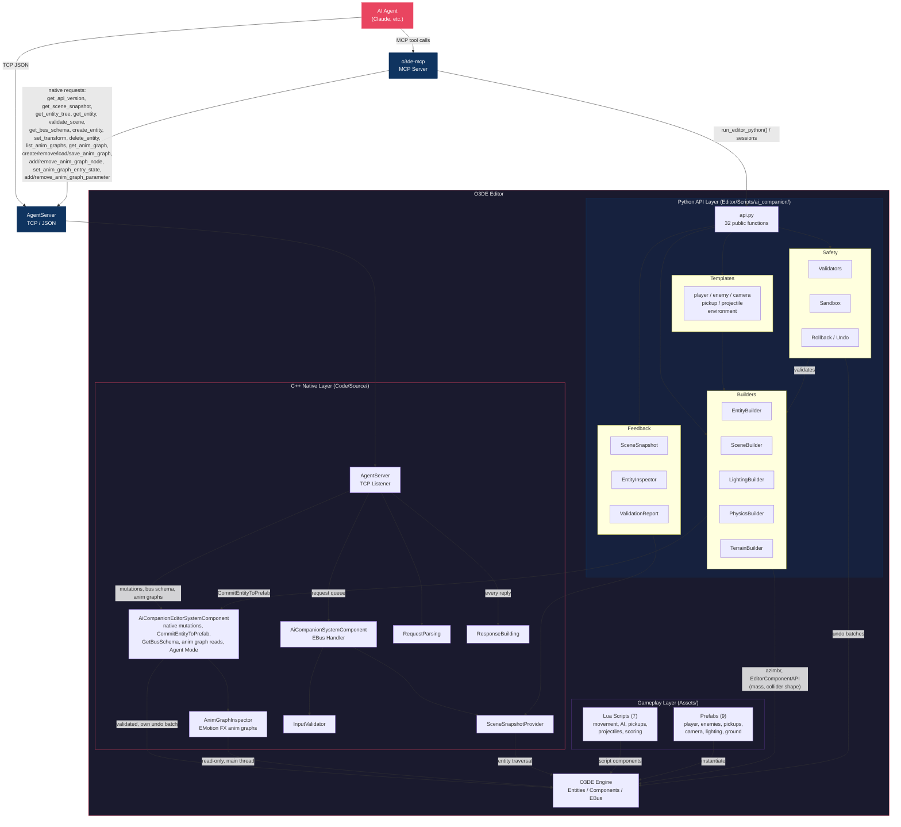

# Architecture

This document describes the high-level architecture of the AI Companion Gem for
Open 3D Engine (O3DE).

## Overview

AI Companion is an O3DE Gem that provides a bridge between AI agents and the O3DE
Editor. It exposes a high-level Python API that AI agents invoke (typically via
[o3de-mcp](https://github.com/nickschuetz/o3de-mcp)) to create entities, set up
scenes, and inspect the running editor state. A C++ layer provides fast scene
introspection via EBus and a TCP-based AgentServer for direct agent communication.

## Architecture Diagram


```mermaid
flowchart TB
    Agent["AI Agent<br/>(Claude, etc.)"]
    MCP["o3de-mcp<br/>MCP Server"]
    AgentSrv["AgentServer<br/>TCP / JSON"]

    subgraph O3DE["O3DE Editor"]
        direction TB

        subgraph PythonAPI["Python API Layer  (Editor/Scripts/ai_companion/)"]
            API["api.py<br/>32 public functions"]

            subgraph Builders["Builders"]
                EB["EntityBuilder"]
                SB["SceneBuilder"]
                LB["LightingBuilder"]
                PB["PhysicsBuilder"]
                TB_["TerrainBuilder"]
            end

            subgraph Templates["Templates"]
                TP["player / enemy / camera<br/>pickup / projectile<br/>environment"]
            end

            subgraph Feedback["Feedback"]
                SS["SceneSnapshot"]
                EI["EntityInspector"]
                VR["ValidationReport"]
            end

            subgraph Safety["Safety"]
                VAL["Validators"]
                SBX["Sandbox"]
                RB["Rollback / Undo"]
            end
        end

        subgraph CppLayer["C++ Native Layer  (Code/Source/)"]
            SysComp["AiCompanionSystemComponent<br/>EBus Handler"]
            EdComp["AiCompanionEditorSystemComponent<br/>native mutations, CommitEntityToPrefab,<br/>GetBusSchema, anim graph reads, Agent Mode"]
            AGI["AnimGraphInspector<br/>EMotion FX anim graphs"]
            SSP["SceneSnapshotProvider"]
            IV["InputValidator"]
            RP["RequestParsing"]
            RSP["ResponseBuilding"]
            AS["AgentServer<br/>TCP Listener"]
        end

        subgraph GameplayLayer["Gameplay Layer  (Assets/)"]
            Lua["Lua Scripts (7)<br/>movement, AI, pickups,<br/>projectiles, scoring"]
            Prefabs["Prefabs (9)<br/>player, enemies, pickups,<br/>camera, lighting, ground"]
        end

        Engine["O3DE Engine<br/>Entities / Components / EBus"]
    end

    Agent -->|"MCP tool calls"| MCP
    Agent -->|"TCP JSON"| AgentSrv
    MCP -->|"run_editor_python() / sessions"| API
    MCP -->|"native requests:<br/>get_api_version, get_scene_snapshot,<br/>get_entity_tree, get_entity, validate_scene,<br/>get_bus_schema, create_entity, set_transform, delete_entity,<br/>list_anim_graphs, get_anim_graph,<br/>create/remove/load/save_anim_graph,<br/>add/remove_anim_graph_node, set_anim_graph_entry_state,<br/>add/remove_anim_graph_parameter"| AgentSrv
    AgentSrv --> AS
    AS --> RP
    AS -->|"every reply"| RSP
    AS -->|"request queue"| SysComp
    AS -->|"mutations, bus schema, anim graphs"| EdComp
    EdComp -->|"validated, own undo batch"| Engine
    EdComp --> AGI
    AGI -->|"read-only, main thread"| Engine
    Builders -->|"CommitEntityToPrefab"| EdComp

    API --> Builders
    API --> Templates
    API --> Feedback
    API --> Safety

    Builders -->|"azlmbr, EditorComponentAPI<br/>(mass, collider shape)"| Engine
    Templates --> Builders
    Feedback --> SSP
    Safety -->|"validates"| Builders
    Safety -->|"undo batches"| Engine

    SysComp --> SSP
    SysComp --> IV
    SSP -->|"entity traversal"| Engine

    Lua -->|"script components"| Engine
    Prefabs -->|"instantiate"| Engine

    style O3DE fill:#1a1a2e,stroke:#e94560,color:#eee
    style PythonAPI fill:#16213e,stroke:#0f3460,color:#eee
    style CppLayer fill:#1a1a2e,stroke:#e94560,color:#eee
    style GameplayLayer fill:#1a1a2e,stroke:#533483,color:#eee
    style Agent fill:#e94560,stroke:#e94560,color:#fff
    style MCP fill:#0f3460,stroke:#0f3460,color:#fff
    style AgentSrv fill:#0f3460,stroke:#0f3460,color:#fff
```

## Component Descriptions

### Python API Layer

The Python API (`Editor/Scripts/ai_companion/`) is the primary interface for AI
agents. All functions return JSON strings for reliable parsing.

| Component | Purpose |
|-----------|---------|
| **api.py** | Main entry point exposing 32 public functions for scene setup, entity creation, inspection, and undo |
| **Builders** | Fluent builder classes for constructing entities, scenes, lighting rigs, physics bodies, and terrain |
| **Templates** | Pre-configured factory functions for common entity types (player, enemy, camera, pickup, projectile, environment) |
| **Feedback** | Scene introspection: snapshots, entity inspection, and validation reports |
| **Safety** | Input validation, operation sandboxing, and automatic undo/rollback |

### C++ Native Layer

The C++ layer (`Code/Source/`) provides performance-critical operations and the
network server.

| Component | Purpose |
|-----------|---------|
| **AiCompanionSystemComponent** | EBus handler connecting Python API to C++ scene operations (`AiCompanionRequestBus`, exported to editor Python as `azlmbr.ai_companion`) |
| **AiCompanionEditorSystemComponent** | Editor-side handler (`AiCompanionEditorRequestBus`): the validated native mutations (`CreateEntity`, `SetTransform`, `DeleteEntity`, each in its own undo batch), `CommitEntityToPrefab` (records an entity in the level template immediately, so multi-entity calls persist), `GetBusSchema`, `ListAnimGraphs` and `GetAnimGraph` (delegated to AnimGraphInspector), the `SetComponentPropertyUnwrapped` workaround, and Agent Mode's dialog filter |
| **SceneSnapshotProvider** | Fast entity traversal and JSON serialization of scene state, whole scene or one entity |
| **InputValidator** | C++ counterpart to Python validators for entity names, positions and component types |
| **RequestParsing** | Parses request arguments (entity ids as numbers or strings, Vector3 arrays within the position bound) for the native request types |
| **ResponseBuilding** | Writes every AgentServer reply (`id`, `status`, `output`, `error`, `duration_ms`, and `code` on the unknown-request-type error only) |
| **BusSchema** | Builds a JSON description of any reflected EBus from the live BehaviorContext, with argument names and tooltips |
| **AnimGraphInspector** | Read-only JSON views of the EMotion FX anim graphs the engine holds (`Code/Source/Animation/`): the listing with ownership flags and actor instances, and one graph's nodes, ports and connections, state transitions with conditions, value parameters and node groups. Resolves the graph from the AnimGraphManager on every call, on the main thread, and never keeps a pointer. Links `Gem::EMotionFX.Editor.Static`; answers `EMotion FX is not available` when that gem is absent |
| **AgentServer** | TCP listener (default `127.0.0.1:4600`) with length-prefixed JSON protocol, TLS support, secure mode, and audit logging |

### Gameplay Layer

| Component | Purpose |
|-----------|---------|
| **Lua Scripts** | 7 scripts covering twin-stick movement, enemy chase AI, damage, health pickups, projectile launching, scoring, and game-over detection |
| **Prefabs** | 9 ready-to-use prefabs for rapid prototyping (player, enemies, pickups, projectile, camera, lighting, ground) |

## Data Flow

1. **AI Agent** sends a request (via MCP tool call or TCP JSON message)
2. **Python API** receives the call and delegates to the appropriate builder or template
3. **Safety layer** validates all inputs (names, positions, asset paths) and begins an undo batch
4. **Builders** invoke `azlmbr` (O3DE Python bindings) to create entities and attach components, then commit each entity to the level's prefab template so the next creation cannot wipe it
5. On success the undo batch is committed; on failure it is rolled back automatically (an editor Undo plus deletion of any entity the undo leaves behind) and the error is returned as JSON with a `code`
6. A **JSON response** with entity IDs, component IDs, and status is returned to the agent
7. The agent can call **Feedback** functions to inspect the scene and decide its next action

## Network Protocol (AgentServer)

The AgentServer uses a length-prefixed JSON protocol over TCP:

```
[4-byte message length (big-endian)] [JSON body]
```

Supported request types: `ping`, `get_api_version`, `get_scene_snapshot`,
`get_entity_tree`, `get_entity`, `validate_scene`, `get_bus_schema`,
`create_entity`, `set_transform`, `delete_entity`, `list_anim_graphs`,
`get_anim_graph`, `create_anim_graph`, `remove_anim_graph`, `load_anim_graph`,
`save_anim_graph`, `add_anim_graph_node`, `remove_anim_graph_node`,
`set_anim_graph_entry_state`, `add_anim_graph_parameter`,
`remove_anim_graph_parameter`, `execute_python`.

`get_entity` takes `entity_id` (decimal, as a number or string) and returns one
entity's transform, parent and component list; `get_bus_schema` takes an
optional `bus_name` and returns the reflected EBus description from the live
`BehaviorContext` (every bus name when `bus_name` is empty). Both are served
in C++ with no Python involved.

`list_anim_graphs` (no parameters) and `get_anim_graph` (`anim_graph_id` as a
number or string, or `file_name`) read EMotion FX anim graphs through the
AnimGraphInspector. The listing gives each graph's `id`, `file_name`,
`owned_by_runtime`, `owned_by_asset`, `dirty`, `num_nodes`, `num_parameters`
and `instances` (each with `entity_id` as a decimal string or null,
`actor_instance_id`, `motion_set`), plus the engine's `editor_mode` flag. The description gives
`root_state_machine_id`, `nodes` (id, name, type, palette name, category,
parent id, state and pose flags, enabled, position, input ports with their
incoming `connection`, output ports), `transitions` (id, state machine,
source and target node ids, wildcard, blend time, priority, disabled,
conditions with type and summary), `parameters` (name, type, description,
default, min, max, group) and `node_groups`. Node and transition ids are
decimal strings. Both are read-only, run on the main thread and are allowed in
secure mode; an unknown graph answers `anim graph not found: <selector>` with
the code `not_found`.

Nine more types author anim graphs through EMotion Studio's command system,
the Animation Editor's own command layer: `create_anim_graph` and
`remove_anim_graph`; `load_anim_graph` (`file_name`: absolute, an `@alias@`
path, or relative to the project root; it must exist and lie inside the
project or engine root); `save_anim_graph` (`anim_graph_id`, optional
`file_name` defaulting to the graph's own; inside the project root; not
undoable); `add_anim_graph_node` (`anim_graph_id`, `node_type` as an
AnimGraphNode class name or palette name, optional `parent_id`, `name` and
`position`); `remove_anim_graph_node` (`node_id`); `set_anim_graph_entry_state`
(`node_id`); `add_anim_graph_parameter` (`name`, `parameter_type`, optional
`default`, `min`, `max`, `description`, `group`); and
`remove_anim_graph_parameter` (`name`). The type fields are `node_type` and
`parameter_type` because `type` is the request envelope's own field. The two
add types answer the node or parameter object exactly as `get_anim_graph`
emits it, and `get_anim_graph` node objects carry `entry_state_id` for state
machines. Every command goes to `EMStudio::GetManager()->GetCommandManager()`
as a string with error handling off, so no error-report window opens, and the
gem validates before sending anything: names (no `"`, `%`, `{`, `}`), node
types (the object factory's creatable AnimGraphNode classes and the Animation
Editor's placement rules), parameter types and value shapes, and file paths.
A graph owned by an asset or a runtime instance is refused for every write
(`validation_failed`), since command edits never reach the asset an Anim Graph
component plays; `load_anim_graph` makes an editable copy. Each request is one
command, or one command group that is undone on failure, so it is one step in
the Animation Editor's own undo history. That history is separate from the
editor's main Undo and from the gem's rollback functions, and a save is not
undoable. Implemented in `Code/Source/Animation/AnimGraphAuthoring`, with the
text rules and command builders in `AnimGraphCommandText`, which the C++ unit
tests cover.

o3de-mcp uses all of them: `ping` for protocol detection, `get_api_version`
inside its `get_capabilities` tool to confirm the gem is present and report its
versions, the four C++ read types behind its `get_scene_snapshot`,
`get_entity_tree`, `get_entity` and `validate_scene` tools, `get_bus_schema`
first in `get_bus_schema_live`, the three mutation types first in its
`create_entity`, `set_transform` and `delete_entity` tools (falling back to
editor Python when the reply carries `unknown_request_type`), and
`execute_python` for everything else (`run_editor_python` and the
`begin_session` / `exec_in_session` tools). o3de-mcp wrappers for
`list_anim_graphs` and `get_anim_graph` are to follow.

`create_entity` (`name`, optional `position` and `parent_id`), `set_transform`
(`entity_id` plus any of `position`, `rotation` as Euler degrees, `scale`) and
`delete_entity` (`entity_id`) are the validated mutation set: each runs the
C++ `InputValidator` on its arguments, refuses missing entities and the level
root, and executes inside its own editor undo batch, so an agent on a
secure-mode editor can still build and tidy a scene without Python.

Every 64-bit entity id in native output (`id` and `parent_id` in
`get_entity`, `get_scene_snapshot` and `get_entity_tree`, `entity_id` in
`validate_scene` reports and in the `create_entity` reply, `deleted` in the
`delete_entity` reply, and the anim graph `instances`) is a decimal string
from `API_VERSION` 0.4.0 on, for the same reason the anim graph ids are: the
values are random 64-bit numbers above 2^53 that a double-based JSON parser
corrupts. Request fields still accept a number or a string. `get_api_version`
reports the convention: `api_version` 0.3.0 and lower meant numbers. The
Python API's own JSON keeps its bracketed `"[id]"` strings.

Every reply is `{"id", "status", "output", "error", "duration_ms"}`, written by
`Network/ResponseBuilding`, and every `error` reply adds a `code` from the
vocabulary in `Network/RequestError`:

| Code | When |
|------|------|
| `validation_failed` | A malformed or refused argument: invalid JSON, a missing `type` or `script` field, a bad base64 script, a missing or unparsable `entity_id` or `anim_graph_id`, an invalid entity name, a position outside the bound, a scale out of range, a refusal to delete the level root, or an anim graph write refused by the gem's own checks (a bad name, type, placement, value or path, or a graph an asset owns) |
| `not_found` | The entity, anim graph or bus does not exist |
| `unavailable` | A subsystem the request needs is not loaded: EMotion FX, EMotion Studio's command system, the gem's editor system component, the prefab system, or the editor's Python runner |
| `engine_error` | The engine refused or failed the operation; `error` is the engine's own text (a prefab system message such as `no root prefab is assigned`, a failed EMotion FX command) |
| `secure_mode` | `execute_python` refused because the server runs in secure mode |
| `execution_failed` | The `execute_python` script raised; `error` holds the traceback and `output` what the script printed first |
| `unknown_request_type` | The request `type` is not one the server serves; the one code a client falls back to editor Python on |
| `timeout` | The editor's main thread did not answer within 30 seconds |
| `shutting_down` | The server was stopping and dropped the request |

The bus events the server calls (`AiCompanionEditorRequestBus::CreateEntity`,
`SetTransform`, `DeleteEntity`, `ListAnimGraphs`, `GetAnimGraph`,
`CreateAnimGraph`, `RemoveAnimGraph`) return their `AZ::Outcome` failure as the
JSON text `{"code", "message"}` from `RequestError::EncodeError`; the server's
`FailureResponse` decodes it into the reply's `code` and `error`, and a plain
text that was never encoded decodes as `engine_error` with the text as the
message. `SceneSnapshotProvider::CaptureEntity` and `BuildBusSchemaJson` keep
answering their own `{"error": ...}` object (the Python package reads the
former through the bus); the server turns that object into an `error` reply
with `not_found`, or the `code` the object names, instead of relaying it as
`ok`. The `code` inside the JSON the Python API prints to `output` is the
package's own vocabulary; the two overlap on `validation_failed`, `not_found`
and `engine_error` by design and differ where the layers differ.

Requests that require main-thread access (every type except `ping` and
`get_api_version`) are dispatched via a lock-free queue from the
client thread to the `AZ::SystemTickBus` handler, which processes them every few
milliseconds regardless of editor focus state. A 30-second timeout prevents
deadlocks if the main thread is blocked.

Security features:
- Optional TLS/SSL encryption (TLS 1.2+, strong cipher suites: `HIGH:!aNULL:!MD5:!RC4`)
- Configurable audit logging (Minimal, Standard, Verbose)
- Maximum message size: 16 MiB
- `execute_python` disabled in secure mode
- Request ID sanitization (alphanumeric, hyphen, underscore) for audit logging
- Injection-proof Python script encoding (hex-escaped byte literals)
- Exclusive temp file creation (`O_EXCL`) with restrictive permissions (`0600`)

Reliability features:
- Socket inheritance prevention (`SOCK_CLOEXEC` / `FD_CLOEXEC` / `SetHandleInformation`)
  ensures only the Editor process owns the listen socket
- Stale connection detection via non-blocking socket probing in the accept loop
- Platform-specific `accept` hardening: `accept4` on Linux, `fcntl` on macOS,
  `SetHandleInformation` on Windows

### Known Limitations

- **No authentication**: The server does not require API keys or tokens. Bind to
  localhost (the default) and rely on OS-level access control.
- **No Python sandbox**: `execute_python` runs arbitrary code with full editor
  privileges. Use secure mode to disable it in untrusted environments.
- **Single client**: Only one TCP connection is accepted at a time.

## Safety Architecture

```
Input arrives
  --> Validators (name format, position bounds, path traversal checks)
    --> Sandbox (operation rate/count limits)
      --> Undo batch opened
        --> O3DE Engine mutation
      --> Undo batch committed (or rolled back on error)
```

Protected entities (`EditorGlobal`, `SystemEntity`, `AZ::SystemEntity`) cannot be
modified. Entity names must match `^[A-Za-z][A-Za-z0-9_-]*$`, positions must be
finite and within +/-10,000 units, and asset paths cannot contain traversal
sequences (`..`) or null bytes.
